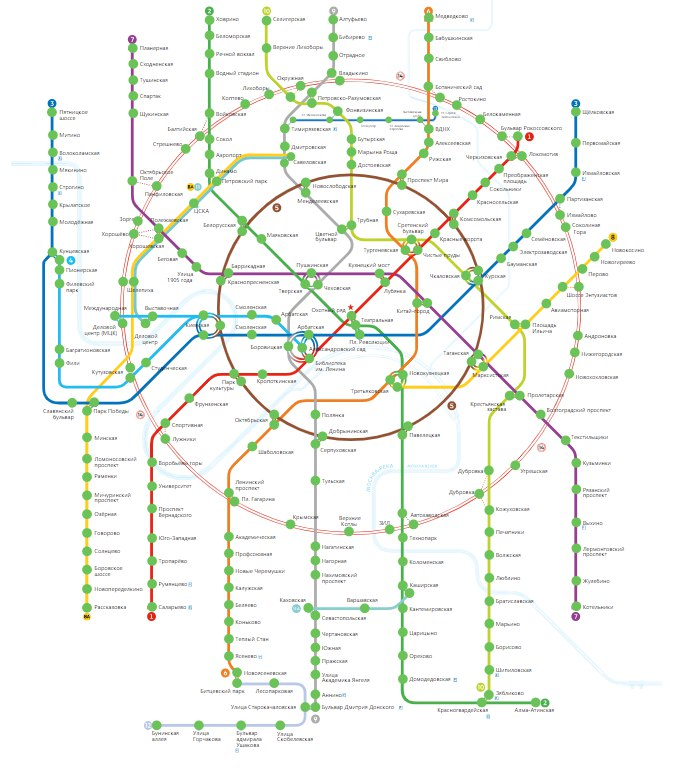
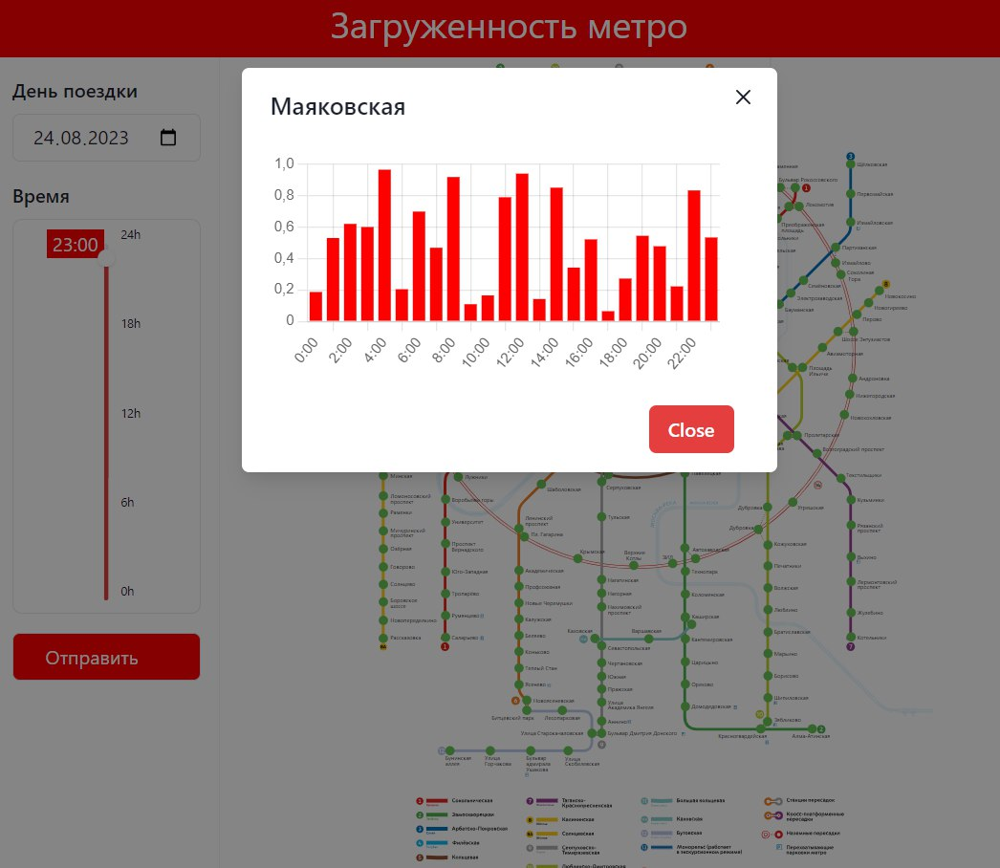

# DriveIt2.0
## FAQ
- Source code will be published as soon as it will be ready

## Description
This repository is a [frontend demo](https://k372470.github.io/driveIt2.0) build of our team's project, which we built on hakaton \[26.07.23\], which was developed within two days
 
Our site gets actual data from server for all stations-overloading and says if its good now or not.

Also, it can get detailed information about selected station (right now, only red-line stations)

## Stack

### Front
 - React
 - react-chart-js-v2
 - redux-toolkit

### Back
 - Python

## Future of this repo
I'll make some fixes in code and after I will have a complete project, this repo will be updated
